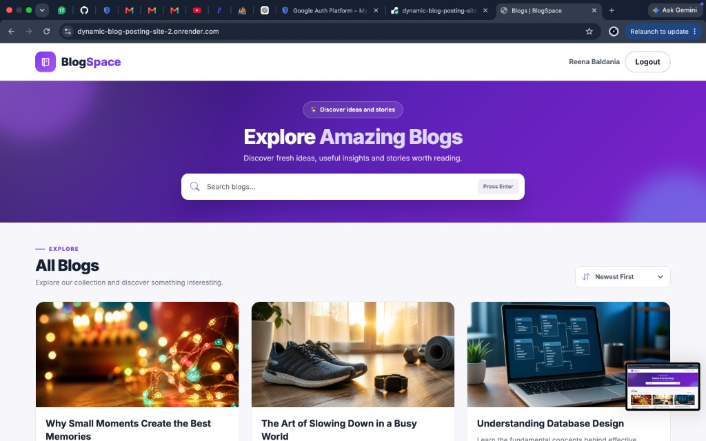
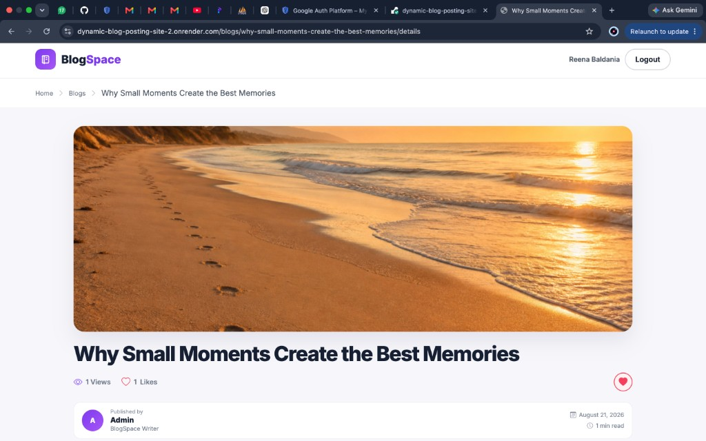
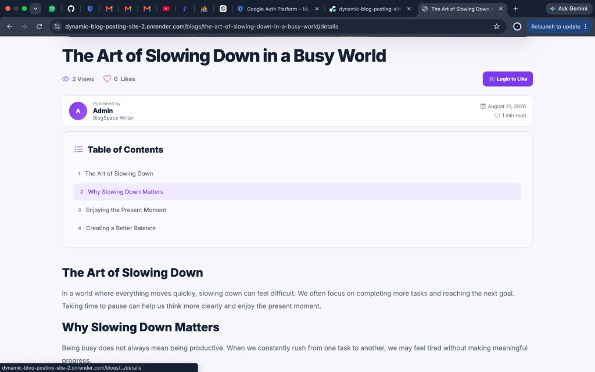
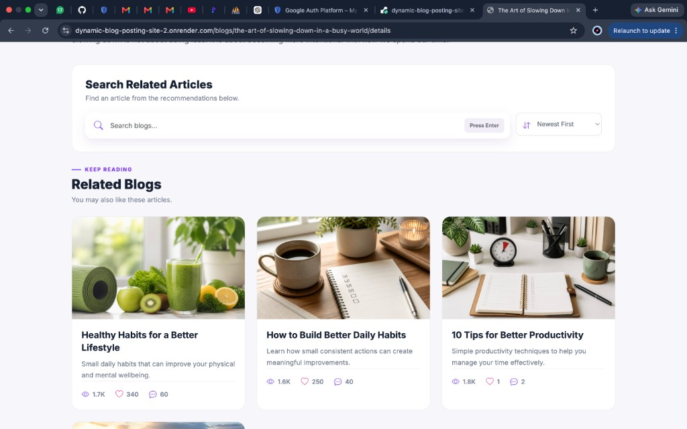
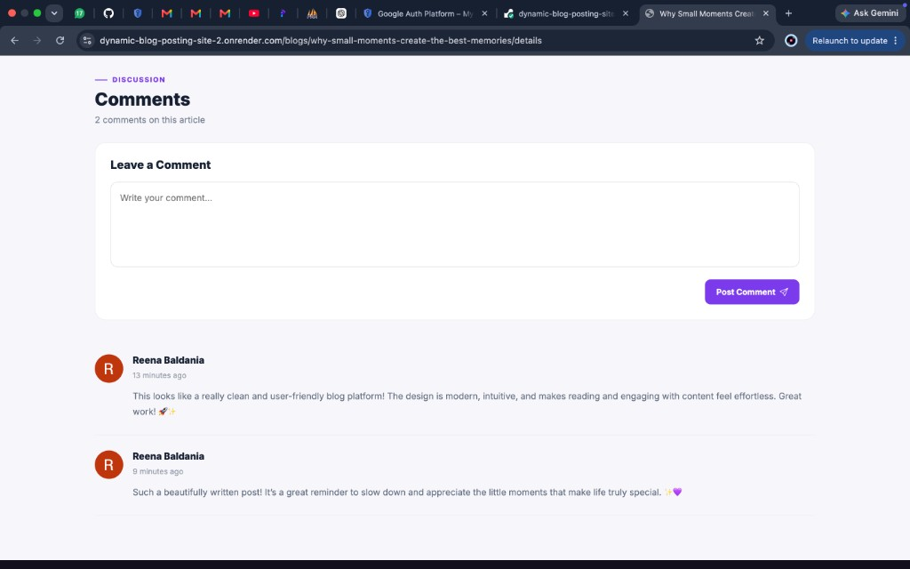
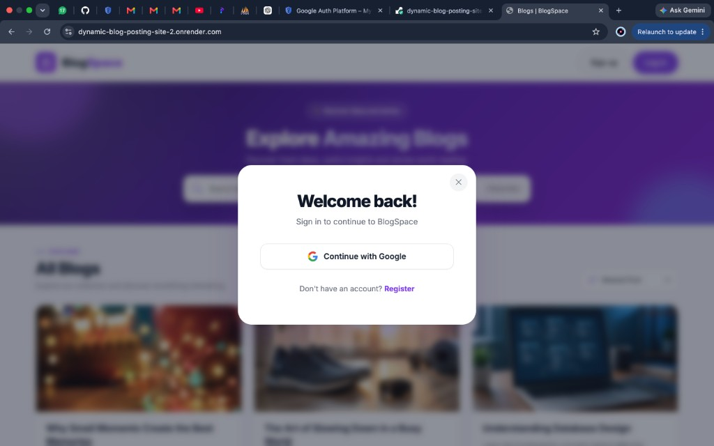
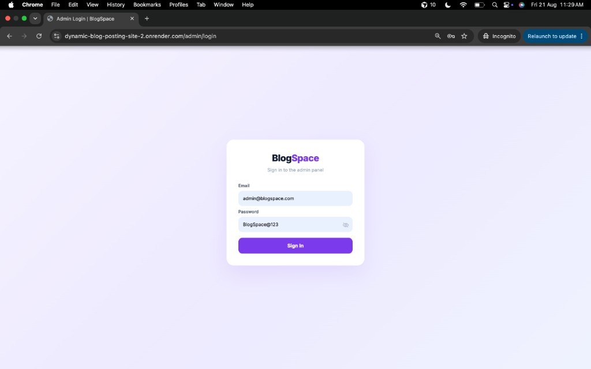
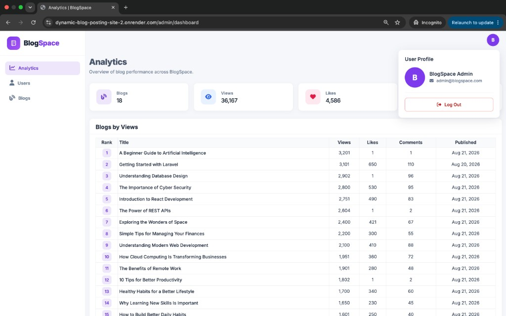
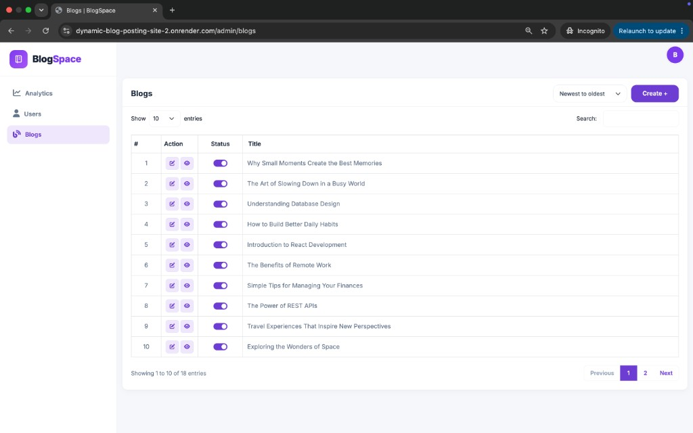
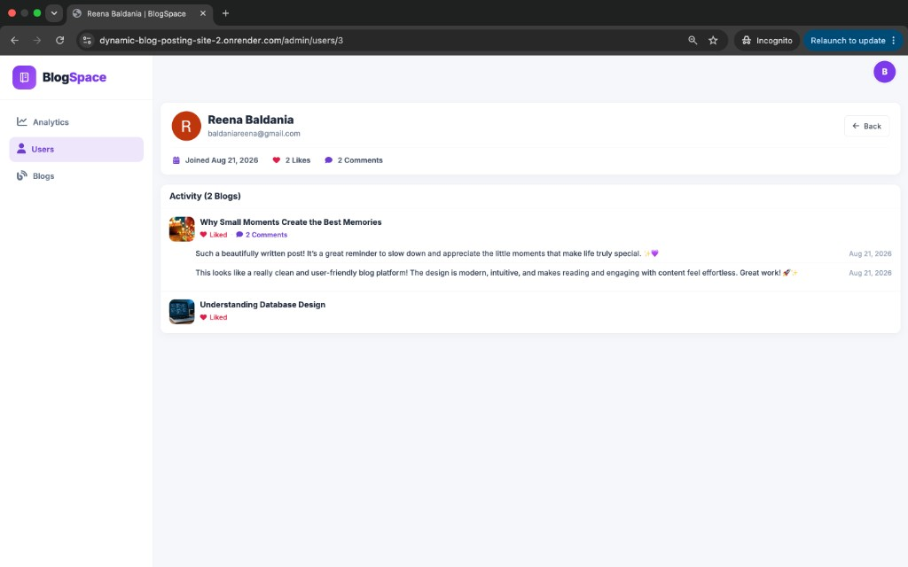

# BlogSpace – Dynamic Blog Posting Site

**Developed by:** Reena Baldania

This project is a dynamic blog posting platform built with Laravel, Bootstrap, jQuery, and MySQL/PostgreSQL. Admins manage blogs from a dashboard. Users sign in with Google to like posts and leave comments.

**Live Demo:** [https://dynamic-blog-posting-site-2.onrender.com/](https://dynamic-blog-posting-site-2.onrender.com/)

---

## Login Credentials

### Admin Panel

**URL:** [https://dynamic-blog-posting-site-2.onrender.com/admin/login](https://dynamic-blog-posting-site-2.onrender.com/admin/login)

**Email:** `admin@blogspace.com`  
**Password:** `BlogSpace@123`

### Frontend Users

Use **Continue with Google** on the home page login / register modal.

---

## Technologies Used

- Laravel 13
- PHP 8.3
- MySQL / PostgreSQL / SQLite
- Bootstrap 5
- jQuery
- AJAX
- DataTables
- Laravel Socialite (Google OAuth)
- Rich Text Editor (CKEditor)
- Vite

---

## Features

### 1. Authentication

- **Admin login:** Direct login using email and password
- **User login:** Google OAuth only

### 2. Admin Panel – Blog Management

Admins can create and manage blogs from the dashboard.

**Blog creation form includes:**

- Title
- Description
- URL slug (auto-generated from title by default, with a toggle for custom URL; slugs must be unique)
- Blog content via rich text editor
  - Paste from Google Docs / Sheets with formatting preserved (headings → `<h2>` / `<h3>`, links kept)
  - Inline image insertion
  - View Code (HTML source) option in the toolbar
- Thumbnail image
- Banner image
- SEO title
- SEO description
- Canonical tag
- Schema markup
- Tags

**Also supported:**

- Auto-generated Table of Contents from all `<h2>` headings in the blog content
- Related blogs section matched by shared tags

### 3. Admin Blog List (Manage Blogs)

- List of all created blogs
- Search bar (search on Enter key)
- Pagination: default 10 per page, dropdown for 20 / 30 / 40 / 50
- Sort filter: Newest to Oldest, Oldest to Newest, A–Z (Alphabetical)

### 4. Frontend – Blog Listing Page

- Grid / list of all blogs
- Each card shows: thumbnail, title, description (max 3 lines), view count, like count, comment count
- Search bar (search on Enter key)
- Sort / filter: A–Z, Newest First, Oldest First

### 5. Frontend – Blog Detail Page

- Breadcrumb navigation
- Banner image
- Title (only one `<h1>` per page)
- Views and likes count
- Like button (logged-in users only)
- Author details (person / company who published the blog)
- Table of Contents
- Full blog content
- Comments section at the end (logged-in users only)
- Related blogs section
- Related blogs search (Enter key) and sort (A–Z, newest, oldest)

### 6. Dashboard – Analytics & Users

**Analytics page**

- Total blogs, views, likes, and comments
- Blogs ranked by view count (highest views on top)

**User management**

- List of all registered / logged-in users
- Click a user to open their profile (likes, comments, and activity)

---

## Database Structure

### Users Table

| Column | Description |
| --- | --- |
| id | Primary key |
| name | User name |
| email | Unique email |
| password | Hashed password (nullable for Google users) |
| google_id | Google account ID |
| avatar | Profile image URL |
| is_admin | Admin flag |
| created_at / updated_at | Timestamps |

### Blogs Table

| Column | Description |
| --- | --- |
| id | Primary key |
| title | Blog title |
| slug | Unique URL slug |
| description | Short description |
| content | Full blog HTML content |
| thumbnail_image | Card thumbnail |
| banner_image | Detail page banner |
| seo_title | SEO title |
| seo_description | SEO description |
| canonical_url | Canonical URL |
| schema_markup | JSON-LD schema |
| tags | Blog tags |
| view_count | Total views |
| like_count | Total likes |
| comment_count | Total comments |
| status | ACTIVE / INACTIVE |
| created_at / updated_at | Timestamps |

### Comments Table

| Column | Description |
| --- | --- |
| id | Primary key |
| blog_id | Foreign key → blogs |
| user_id | Foreign key → users |
| body | Comment text |
| created_at / updated_at | Timestamps |

### Blog Likes Table

| Column | Description |
| --- | --- |
| id | Primary key |
| blog_id | Foreign key → blogs |
| user_id | Foreign key → users |
| created_at / updated_at | Timestamps |

---

## Project Setup Instructions

1. **Clone the Repository**

git clone https://github.com/reena0046/dynamic-blog-posting-site.git

2. **Go to Project Folder**

cd dynamic-blog-posting-site

3. **Install PHP Dependencies**

composer install

4. **Install Frontend Dependencies & Build Assets**

npm install
npm run build

5. **Copy Environment File**

cp .env.example .env

6. **Generate Application Key**

php artisan key:generate

7. **Configure Database**

Open the `.env` file and update database settings (example for MySQL):
env
DB_CONNECTION=mysql
DB_HOST=127.0.0.1
DB_PORT=3306
DB_DATABASE=blogspace
DB_USERNAME=root
DB_PASSWORD=

8. **Configure Google OAuth (for user login)**
env
GOOGLE_CLIENT_ID=your-client-id
GOOGLE_CLIENT_SECRET=your-client-secret
GOOGLE_REDIRECT_URI=http://127.0.0.1:8000/auth/google/callback

Add the same redirect URI in Google Cloud Console → Authorized redirect URIs.

9. **Run Migrations & Seeders**

php artisan migrate --seed

10. **Create Storage Link**

php artisan storage:link

11. **Start Server**

php artisan serve

Open: [http://127.0.0.1:8000](http://127.0.0.1:8000)

---

## Screenshots

### Blog Listing Page

### Blog Detail Page

### Table of Contents

### Related Blogs

### Comments Section

### Google Login

### Admin Login Page

### Admin Dashboard (Analytics)

### Admin Blog List

### User Profile (Activity)

---

## Author

**Reena Baldania**

Backend Developer | Laravel | PHP | REST APIs | MySQL
